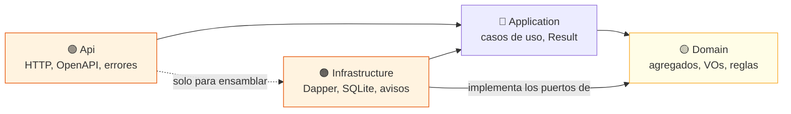
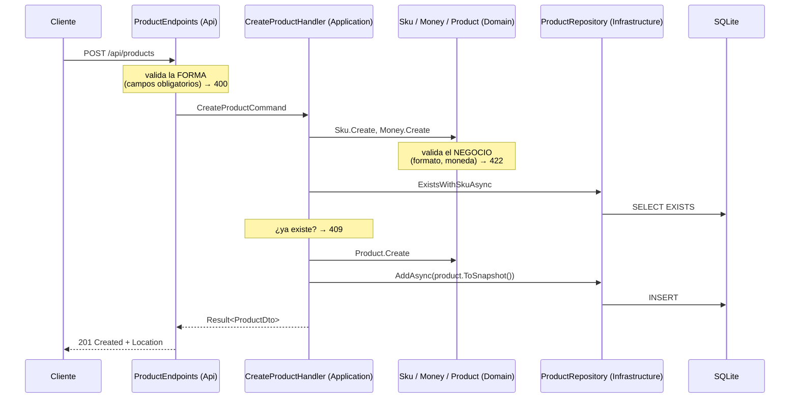

# 🏛️ DDD y Clean Architecture con .NET 10 — repositorio para aprender

[](https://github.com/AndresVegaP/clean-architecture-ddd-dotnet/actions/workflows/ci.yml)
[](https://dotnet.microsoft.com/)
[](LICENSE)

Una API REST de **catálogo y pedidos** construida para **enseñar**, paso a paso,
Domain-Driven Design y Clean Architecture con .NET 10, Dapper y SQLite.

No es una plantilla para copiar y pegar: es un **curso con código ejecutable**.
Cada decisión está explicada, cada regla tiene su test y cada módulo del curso
te dice qué leer, qué romper a propósito y cómo saber que lo entendiste.

> **¿Para quién es?** Si sabes lo básico de programación y quieres llegar a
> dominar DDD y Clean Architecture, empieza por
> [docs/00-antes-de-empezar.md](docs/00-antes-de-empezar.md).
> Si ya programas en C#, ve directo a [la ruta de aprendizaje](#-ruta-de-aprendizaje).

## 🚀 Arrancar en tres comandos

Necesitas el [SDK de .NET 10](https://dotnet.microsoft.com/download) (`dotnet --version` debe empezar por `10.`).

```bash
git clone https://github.com/AndresVegaP/clean-architecture-ddd-dotnet.git
```

```bash
dotnet run --project src/CleanArchitecture.Api
```

```bash
dotnet test
```

Abre **http://localhost:5000/swagger** para probar la API desde el navegador.
La base de datos SQLite se crea sola; no hay que instalar nada más.

## 🤔 ¿Qué es Clean Architecture?

Una forma de organizar el código en capas donde las dependencias **siempre
apuntan hacia el centro**, y en el centro vive lo más valioso: las reglas de
negocio.



**La regla de oro (Dependency Rule):** una capa interior **jamás** conoce a las
exteriores. `Domain` no sabe que existe Dapper; `Application` no sabe que existe
HTTP. Los detalles (base de datos, web) son **reemplazables**; el negocio es
**estable**.

¿Y cómo guarda datos un caso de uso que no conoce la base de datos? Con
**inversión de dependencias**: el dominio declara la interfaz
([`IProductRepository`](src/CleanArchitecture.Domain/Products/IProductRepository.cs))
y la infraestructura la implementa. Es el concepto más importante del repo.

Y no es solo una promesa escrita: hay
[tests que hacen fallar el build](tests/CleanArchitecture.ArchitectureTests/DependencyRuleTests.cs)
si alguien rompe la regla.

## 🧭 Una petición, de punta a punta



## 📁 Estructura del repositorio

```
├── docs/                                  📚 el curso: módulos, glosario y decisiones (ADR)
├── src/
│   ├── CleanArchitecture.Domain/          🟡 agregados, value objects, reglas   (0 dependencias)
│   │   ├── Common/                           bloques base: Entity, AggregateRoot, ValueObject
│   │   ├── SharedKernel/                     Money y Currency (los usan varios agregados)
│   │   ├── Products/                         agregado Product + su puerto
│   │   └── Orders/                           agregado Order + OrderLine + eventos
│   ├── CleanArchitecture.Application/     🔵 casos de uso, Result, puertos      (→ Domain)
│   ├── CleanArchitecture.Infrastructure/  🟠 Dapper, SQLite, transacciones      (implementa puertos)
│   └── CleanArchitecture.Api/             🟢 endpoints, OpenAPI, errores        (ensambla todo)
└── tests/
    ├── CleanArchitecture.UnitTests/          dominio y casos de uso, sin E/S
    ├── CleanArchitecture.IntegrationTests/   SQL real, API en memoria, contrato OpenAPI
    └── CleanArchitecture.ArchitectureTests/  la Dependency Rule, ejecutable
```

## 📚 Ruta de aprendizaje

Cada módulo tiene la misma estructura: **objetivos**, **conceptos**, **qué leer y
en qué orden**, un **experimento** para romper el código a propósito, un
**ejercicio** con pistas y una **autoevaluación**.

| # | Módulo | Qué te llevas |
|---|---|---|
| 00 | [Antes de empezar](docs/00-antes-de-empezar.md) | Instalar .NET 10, ejecutar, depurar, usar Swagger |
| 01 | [El C# que necesitas](docs/01-csharp-minimo.md) | Records, interfaces, genéricos, async, LINQ, nullable |
| 02 | [Clean Architecture](docs/02-clean-architecture.md) | Capas, Dependency Rule, puertos y adaptadores |
| 03 | [Value Objects](docs/03-value-objects.md) | Estados inválidos imposibles de representar |
| 04 | [Entidades e invariantes](docs/04-entidades.md) | Identidad, modelo rico frente a anémico |
| 05 | [Agregados](docs/05-agregados.md) | Fronteras de consistencia, entidades hijas, servicios de dominio |
| 06 | [Repositorios, Dapper y Snapshots](docs/06-repositorios-dapper-y-snapshots.md) | Persistir sin romper la encapsulación |
| 07 | [Casos de uso](docs/07-casos-de-uso.md) | Result, CQRS, DTOs, orquestar sin decidir |
| 08 | [La API y OpenAPI 3.0](docs/08-api-http-y-openapi.md) | Contratos, Problem Details, 400 vs 409 vs 422 |
| 09 | [Tests](docs/09-tests.md) | Unitarios, integración, arquitectura y contrato |
| 10 | [Transacciones y concurrencia](docs/10-transacciones-y-concurrencia.md) | Unit of Work, actualizaciones perdidas |
| 11 | [Eventos de dominio](docs/11-eventos-de-dominio.md) | Reaccionar a hechos sin acoplar |
| 12 | [Proyecto final](docs/12-proyecto-final.md) | Ejercicios en orden, del más fácil al más difícil |

Complementos: [glosario](docs/glosario.md) ·
[DDD estratégico](docs/ddd-estrategico.md) ·
[decisiones de diseño (ADR)](docs/adr/) ·
[convención de documentación](docs/convencion-de-documentacion.md)

## ⭐ Qué hace distinto a este repositorio

- **Dos agregados, no uno.** `Product` enseña lo básico; `Order` (con sus líneas)
  enseña lo que de verdad separa a un junior de un experto: entidades hijas,
  referencias por Id, fronteras de consistencia y eventos.
- **Patrón Snapshot.** El agregado entrega una copia plana de su estado para
  guardarse y sabe reconstruirse desde ella, sin abrir su encapsulación.
- **La arquitectura se ejecuta.** Tests que fallan si alguien rompe la
  Dependency Rule, o si un repositorio deja de ser `sealed`.
- **Errores como ciudadanos de primera.** Cada regla de negocio tiene un código
  estable (`Product.InsufficientStock`) que viaja hasta la respuesta HTTP.
- **Concurrencia de verdad.** Versión por agregado, transacciones con Dapper y
  tests que reproducen la actualización perdida.
- **OpenAPI 3.0 documentado y verificado** por tests de contrato.
- **Honestidad.** Cada decisión discutible tiene su [ADR](docs/adr/) explicando
  qué se descartó y por qué.

## 🧪 Cómo ejecutar los tests

```bash
dotnet test
```

```bash
dotnet test --filter-class "*ProductTests*"
```

| Proyecto | Qué prueba | Cuánto tarda |
|---|---|---|
| `UnitTests` | Reglas de negocio y casos de uso, con dobles en memoria | milisegundos |
| `IntegrationTests` | SQL real con SQLite, API completa en memoria, documento OpenAPI | segundos |
| `ArchitectureTests` | Que las dependencias entre capas sigan siendo correctas | segundos |

## 📖 Para seguir profundizando

- *Domain-Driven Design* — Eric Evans (el libro original)
- *Implementing Domain-Driven Design* — Vaughn Vernon (el más práctico)
- *Clean Architecture* — Robert C. Martin
- Plantillas de la comunidad .NET: `jasontaylordev/CleanArchitecture` y
  `ardalis/CleanArchitecture` (compara sus decisiones con las de aquí: de las
  diferencias se aprende muchísimo)

## 📄 Licencia

[MIT](LICENSE). Úsalo, modifícalo y enséñalo.
